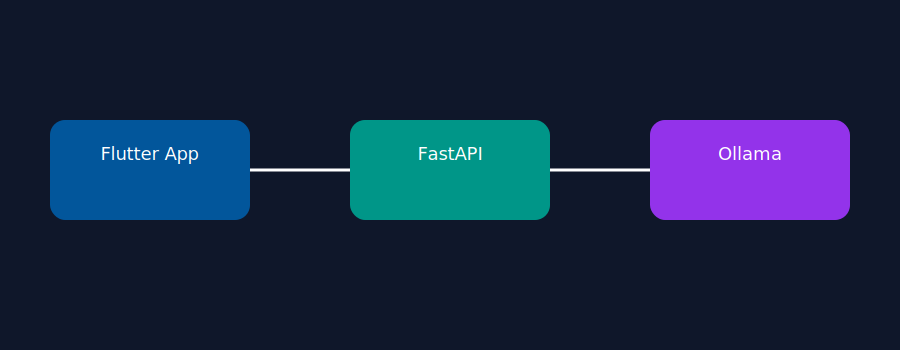
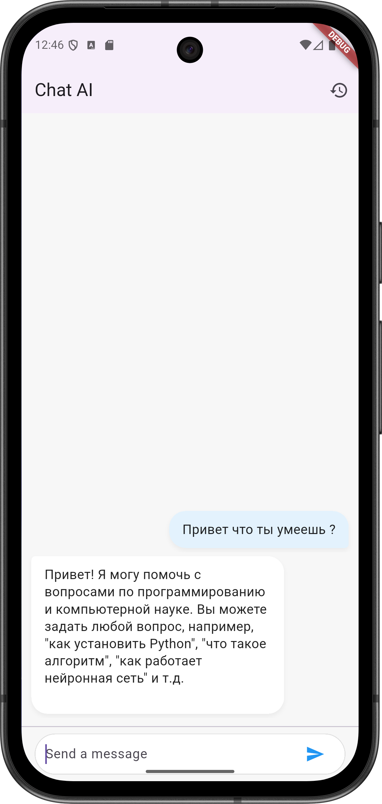
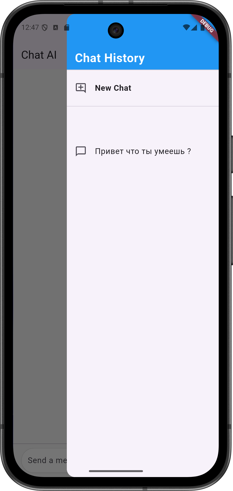

# 🤖 Local AI Chat
### FastAPI + Ollama + Flutter

  

  
  
  

---

## 📌 Жоба туралы

**Local AI Chat** — бұл интернетсіз жұмыс істейтін мобильді AI чат жүйесі.

Жоба FastAPI арқылы Ollama локалды моделіне сұраныс жібереді,  
ал Flutter қолданушы интерфейсі арқылы жауаптарды көрсетеді.

---

## 🏗 Архитектура

  

---

## 🚀 Мүмкіндіктері

- 🧠 Локалды LLM (Ollama)
- ⚡ FastAPI REST API
- 📱 Flutter мобильді интерфейс
- 🔄 Реалтайм чат
- 🔒 Интернетсіз жұмыс

---

## 🛠 Қолданылған технологиялар

### Backend
- Python
- FastAPI
- Uvicorn
- Ollama

### Frontend
- Flutter
- Dart

---

  

 

